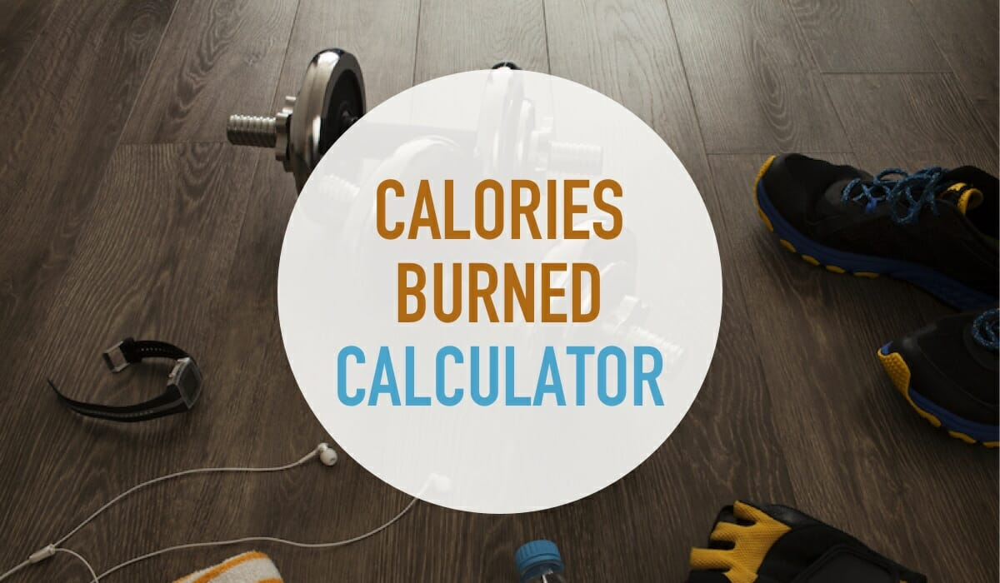

```{r setup, include=FALSE}
library(tidyverse)
library(knitr)
library(dplyr)
library(lubridate)
library(ggplot2)
library(plotly)
library(broom)
library(tableone)
library(kableExtra)
library(modelr)
library(mgcv)
library(leaflet)
library(tmaptools)

options(scipen = 999)

knitr::opts_chunk$set(
        collapse = TRUE, 
        message = FALSE, 
        warning = FALSE,
  fig.width = 6,
  fig.asp = .6,
  out.width = "90%"
  )

theme_set(theme_minimal() + 
            theme(
              legend.position = "bottom", 
              panel.background = element_rect(fill = "#FFFFFF", color = NA), 
              panel.grid.major = element_line(color = "#D6DBDF"),          
              panel.grid.minor = element_blank(),                          
              plot.title = element_text(size = 16, color = "#333333", face = "bold"),
              axis.title = element_text(size = 14, color = "#333333"),     
              axis.text = element_text(size = 12, color = "#6C757D"),      
              legend.background = element_rect(fill = "#F5F5F5"),          
              legend.key = element_rect(fill = "#FFFFFF")                  
            )
)

update_geom_defaults("bar", list(fill = "#6C757D"))   
update_geom_defaults("point", list(colour = "#A3C9A8")) 
update_geom_defaults("line", list(colour = "#F4A261")) 


scale_colour_discrete <- function(...) scale_colour_manual(values = c(
  "#6C757D", "#A3C9A8", "#F4A261", "#E76F51"), ...)
scale_fill_discrete <- function(...) scale_fill_manual(values = c(
  "#6C757D", "#A3C9A8", "#F4A261", "#E76F51"), ...)


options(
  ggplot2.continuous.colour = "viridis",
  ggplot2.continuous.fill = "viridis"
)
```


## Motivation

In modern society, fitness has become an integral part of many people's daily lives. However, there is limited in-depth data analysis on the behavioral patterns, demographic characteristics, and geographic distributions of gym-goers. This project aims to address this gap by systematically analyzing data on calorie expenditure, workout duration, and subscription plan choices among gym-goers to identify key factors influencing these behaviors. Our goal is to provide valuable insights for the fitness industry, public health researchers, and policymakers, enabling them to better understand fitness trends and develop more effective interventions and strategies to promote overall health.

<br>

## Related Work

In the "Gym Goer Trends" project, we drew inspiration from several key resources. The [2022 Fitness Behavior and Consumer Research Report](https://shipin.sportshow.com.cn/file/pdf/2022DZJS.pdf) provided insights into fitness trends and socioeconomic impacts. A study on [Machine Learning for Calorie Estimation](https://blog.csdn.net/2301_79555157/article/details/135997594) introduced innovative approaches to predict calorie consumption using image recognition. Additionally, a [Survey on Residents’ Fitness Habits](https://pdf.hanspub.org/SA20210400000_42931384.pdf) analyzed fitness behaviors across cities, offering valuable context for our analysis. These resources guided our exploration of fitness behaviors, calorie consumption, and workout trends.

<br>

## Initial Questions

- What factors contribute to the calories a user burns in gyms? 

- What factors contribute to the workout duration and frequency of users' gym visits?

- What factors contribute to the selection of users' subscription plans?

<br>

## Data Source and Cleaning

You can find the raw datasets [here](https://www.kaggle.com/datasets/mexwell/gym-check-ins-and-user-metadata). Click the button to show relative code. 

```{r data cleaning}
# Import 4 raw datasets
users_data = read_csv("datasets/users_data.csv")
gyms_data = read_csv("datasets/gym_locations_data.csv")
history_data = read_csv("datasets/checkin_checkout_history_updated.csv")
plans_data = read_csv("datasets/subscription_plans.csv")

# Clean/tidy 4 datasets
## 1. users_data --> users_tidy:
users_tidy = users_data |>
  mutate(
    name = paste(first_name, last_name),
    membership_days = as.numeric(difftime(as.Date("2024-09-30"), as.Date(sign_up_date, format = "%Y-%m-%d"), units = "days"))
  ) |>
  select(user_id, name, age, gender, membership_days, user_location, subscription_plan)

## 2. gyms_data --> gyms_tidy:
gyms_tidy = gyms_data |>
  mutate(
    climbing_wall = ifelse(grepl("Climbing Wall", facilities), 1, 0),
    swimming_pool = ifelse(grepl("Swimming Pool", facilities), 1, 0),
    basketball_court = ifelse(grepl("Basketball Court", facilities), 1, 0),
    yoga_classes = ifelse(grepl("Yoga Classes", facilities), 1, 0),
    sauna = ifelse(grepl("Sauna", facilities), 1, 0),
    crossfit = ifelse(grepl("CrossFit", facilities), 1, 0)) |>
  select(gym_id, location, gym_type, climbing_wall, swimming_pool, basketball_court, yoga_classes, sauna, crossfit)

## 3. history_data --> history_tidy
history_tidy = history_data |>
  mutate(
    workout_year = year(as.Date(checkin_time, format = "%Y-%m-%d %H:%M:%S")),
    workout_month = month(as.Date(checkin_time, format = "%Y-%m-%d %H:%M:%S")),
    workout_time = format(as.POSIXct(checkin_time, format = "%Y-%m-%d %H:%M:%S"), "%H:%M"),
    workout_duration = as.numeric(difftime(as.POSIXct(checkout_time, format = "%Y-%m-%d %H:%M:%S"),
                                         as.POSIXct(checkin_time, format = "%Y-%m-%d %H:%M:%S"),
                                         units = "mins")),
    workout_timecat = case_when(
      hour(as.POSIXct(checkin_time, format = "%Y-%m-%d %H:%M:%S")) %in% 6:11 ~ "morning",
      hour(as.POSIXct(checkin_time, format = "%Y-%m-%d %H:%M:%S")) %in% 12:17 ~ "afternoon",
      TRUE ~ "evening"
    ),
    calories_per_min = round(ifelse(workout_duration > 0, calories_burned / workout_duration, 0), 2)
  ) |>
  select(user_id, gym_id, workout_year, workout_month, workout_time, workout_timecat, workout_type, workout_duration, calories_burned, calories_per_min)

## 4. plans_data --> plans_tidy
plans_tidy = plans_data |>
  select(subscription_plan, price_per_month)

# Merge 4 datasets to get the final dataset
## 1. users_tidy & history_tidy, by user_id
users_history_tidy = history_tidy |>
  left_join(users_tidy |>
              rename(user_name = name),
            by = "user_id")

## 2. users_history_tidy & gyms_tidy, by gym_id
users_gyms_tidy = users_history_tidy |>
  left_join(gyms_tidy |>
              rename(gym_location = location),
            by = "gym_id")

## 3. users_gyms_tidy & plans_tidy, by subscription_plan
final = users_gyms_tidy |>
  left_join(plans_tidy, by = "subscription_plan")
```

### Importing Raw Datasets

Four raw datasets were imported for analysis:

- `users_data`: User demographic and subscription information.

- `gyms_data`: Details about gym locations and available facilities.

- `history_data`: Workout history, including check-in/out times and calories burned.

- `plans_data`: Subscription plans with associated pricing.

### Cleaning Steps

1. **`users_data`**: 
   - Created `name` by combining first and last names.
   
   - Calculated `membership_days` from the sign-up date to 2024-09-30.
   
   - Retained essential columns: `user_id`, `name`, `age`, `gender`, `membership_days`, `user_location`, and `subscription_plan`.

2. **`gyms_data`**: 
   - Converted gym facilities into binary indicators ($1 = present,\ 0 = absent$) for `climbing_wall`, `swimming_pool`, `basketball_court`, `yoga_classes`, `sauna`, and `crossfit`.
   
   - Retained relevant columns: `gym_id`, `location`, `gym_type`, and facility indicators.

3. **`history_data`**:
   - Extracted year and month as `workout_year` and `workout_month`.
   
   - Calculated `workout_duration` (minutes) from check-in and check-out times.
   
   - Categorized workout times into `morning`, `afternoon`, and `evening` periods (`workout_timecat`).
   
   - Calculated `calories_per_min` as calories burned divided by workout duration.
   
   - Retained key columns: `user_id`, `gym_id`, `workout_year`, `workout_month`, `workout_time`, `workout_timecat`, `workout_type`, `workout_duration`, `calories_burned`, and `calories_per_min`.

4. **`plans_data`**: 
   - Retained columns for subscription plans and their prices: `subscription_plan`, `price_per_month`.

### Merging Datasets

1. **Step 1**: Merged `users_tidy` with `history_tidy` by `user_id`, renaming `name` to `user_name`.

2. **Step 2**: Merged `users_history_tidy` with `gyms_tidy` by `gym_id`, renaming `location` to `gym_location`.

3. **Step 3**: Merged `users_gyms_tidy` with `plans_tidy` by `subscription_plan`.

The final dataset, `final`, contains `r ncol(final)` variables for analysis and `r nrow(final)` observations. Below is the codebook for `final`:

```{r echo=FALSE}
kable(data.frame(
  ID = c(
    "1", "2", "3", "4", "5", "6", "7", "8", "9", "10", "11", "12", "13", "14", "15", "16", "17", "18", "19", "20", "21", "22", "23", "24", "25"
  ),
  Variable = c(
    "`user_id`", "`gym_id`", "`workout_year`", "`workout_month`", "`workout_time`", 
    "`workout_timecat`", "`workout_type`", "`workout_duration`", "`calories_burned`", 
    "`calories_per_min`", "`user_name`", "`age`", "`gender`", "`membership_days`", 
    "`user_location`", "`subscription_plan`", "`gym_location`", "`gym_type`", 
    "`climbing_wall`", "`swimming_pool`", "`basketball_court`", "`yoga_classes`", 
    "`sauna`", "`crossfit`", "`price_per_month`"
  ),
  Description = c(
    "Unique identifier for each user",
    "ID of the gym where the check-in occurred",
    "Year of check-in time",
    "Month of check-in time",
    "Exact check-in time",
    "morning (6:00-11:59); afternoon (12:00-17:59); evening (18:00-24:00)",
    "Type of workout performed during the visit (e.g., Cardio, Weightlifting, Yoga)",
    "“Check-out time” – “Check-in time” (minute)",
    "Estimated number of calories burned during the workout",
    "Calories burned per minute",
    "Users’ full name",
    "Age of the user",
    "Male; Female; Non-binary",
    "Total days of membership (from signed-up to 2024-9-31--when the datasets were last updated by the author)",
    "City where the user lives",
    "The user's gym subscription plan (Basic, Pro, Student)",
    "Location of gym",
    "The type of gym (Premium, Standard, Budget)",
    "One of the facilities. 1=yes; 0=no",
    "One of the facilities. 1=yes; 0=no",
    "One of the facilities. 1=yes; 0=no",
    "One of the facilities. 1=yes; 0=no",
    "One of the facilities. 1=yes; 0=no",
    "One of the facilities. 1=yes; 0=no",
    "Price per month in Dollar"
  )
))

```

<br>

## Exploratory Data Analysis
### Calories Burned and Workout Duration

We create a 2D histogram visualizes to represent the relationship between workout duration and calories burned per minute. 

```{r}
plot1 =
  final |>
  ggplot(aes(x = workout_duration, y = calories_per_min)) +
  geom_bin2d() +
  scale_fill_gradientn(colors = c("#FFFFFF", "#A3C9A8", "#F4A261", "#E76F51")) +
  labs(
    title = "Scatter Plot of Workout Duration and Calories Burned", 
    x = "Workout Duration (minutes)", 
    y = "Calories Burned per Minute"
  )
ggplotly(plot1)
```

It reveals that shorter workout durations are generally associated with higher calorie burn rates, while longer durations show lower burn rates, likely reflecting pacing effects. The highest density of data points appears concentrated at higher durations and moderate calorie burn rates.

### Calories Burned and Workout Types

```{r}
generate_histogram <- function(data, workout_type) {
  plot_ly(
    data = subset(data, workout_type == workout_type),
    x = ~calories_per_min,
    type = "histogram",
    opacity = 0.7,
    name = workout_type
  )
}

workout_type = final |> 
  distinct(workout_type) |> 
  pull(workout_type)

plots = lapply(workout_type, function(wt) generate_histogram(final, wt))

plot2 = subplot(
  plots, 
  nrows = 2,  
  shareX = TRUE, shareY = TRUE  
) %>% layout(
  title = "Calories Burned Per Minute Distribution by Workout Type",
  xaxis = list(title = "Calories Burned Per Minute"),
  yaxis = list(title = "Count")
)

plot2
```

This histogram shows the distribution of calories burned per minute across different workout types. Most activities cluster around lower calorie burn rates (below 15 calories per minute), with a sharp decline in frequency as the rate increases. The overlap in distributions suggests similarities in calorie burn patterns across workout types, though some types like Yoga and Weightlifting dominate the lower range.

### Temporal Analysis of Gym Check-in Patterns Across Different Locations
```{r}
hourly_checkins_by_location <- final |> 
  mutate(hour = as.numeric(substr(workout_time, 1, 2))) |> 
  group_by(gym_location, hour) |> 
  summarize(
    check_in_count = n(),
    percentage = n() / nrow(final) * 100
  ) |> 
  filter(hour >= 6 & hour <= 20) |> 
  arrange(gym_location, hour)

n_locations <- length(unique(hourly_checkins_by_location$gym_location))

hourly_checkins_location <- ggplot(hourly_checkins_by_location, 
       aes(x = hour, 
           y = check_in_count, 
           color = gym_location,
           group = gym_location)) +
  geom_line(size = 1) +
  geom_point(size = 2) +
  labs(
    title = "Hourly Gym Check-ins Distribution by Location",
    x = "Hour of Day",
    y = "Number of Check-ins",
    color = "Location"
  ) +
  theme_minimal() +
  scale_x_continuous(
    breaks = 6:20,
    labels = function(x) sprintf("%02d:00", x)
  ) + 
  scale_color_manual(values = c(
    "#709FB0", "#C1D7B7", "#FFCB77", "#D1495B",
    "#8D5A97", "#00A6A6", "#6C757D", "#A3C9A8",
    "#F4A261", "#E76F51"
  ))

ggplotly(hourly_checkins_location)
```

<p style="text-align:center; font-size:15px; font-style:italic; color:gray;">
  Please click location to explore in detail.
<P>

Analysis of check-in data reveals distinct hourly patterns across gym locations, with the primary peak occurring at 14:00 (2 PM), while Phoenix and San Antonio notably show strong morning peaks at 09:00 (9 AM). Daily activity follows a consistent rhythm: moderate early morning activity (6:00-8:00), varied mid-morning patterns (9:00-11:00), peak activity during lunch hours (12:00-14:00), and diverse evening patterns (18:00-20:00) across locations. Each location demonstrates unique characteristics, with San Diego showing the most dramatic fluctuations including a notable drop at 13:00, Phoenix displaying highly variable check-in patterns throughout the day, and Dallas exhibiting particularly strong midday attendance, suggesting an active lunch-break workout culture.

### Age and Workout Duration
```{r}
Age = ggplot(final, aes(x = age)) +
  geom_histogram(
    binwidth = 5
  ) +
  labs(
    title = "Distribution of Age",
    x = "Age",
    y = "Count"
  ) +
  theme_minimal() +
  scale_x_continuous(breaks = seq(20, 70, by = 10)) +
  scale_y_continuous(breaks = seq(0, 35000, by = 10000))+
  theme(plot.title = element_text(hjust = 0.5))
ggplotly (Age)
```

The age distribution histogram reveals that gym membership is fairly consistent across ages 20-60, with the highest concentration around age 40-45 (~35,000 members). There is a notable decrease in membership after age 60, dropping to about 13,000 members in the 65-70 age group.

### Gender and Workout Duration
```{r}
Gender = ggplot(final, aes(x = workout_duration, fill = gender)) +
  geom_histogram(binwidth = 10) +
  facet_wrap(~gender) +
  labs(title = "Workout Duration by Gender", x = "Workout Duration (minutes)", y = "Count") +
  theme_minimal()+
  theme(plot.title = element_text(hjust = 0.5))
ggplotly(Gender)
```

Male members show the highest participation (~7,500-8,000 per duration interval), followed by female members (~7,000-7,500), and non-binary members (~2,000). Interestingly, all gender groups display similar workout duration patterns, typically exercising between 30-180 minutes, with consistent numbers in the 60-150 minute range. The similar distribution shapes suggest that workout duration preferences are relatively consistent across genders, with the main difference being in participation numbers rather than duration patterns.

### Gym Type and Workout Duration
```{r}
detailed_stats <- final |> 
  group_by(gym_type) |> 
  summarise(
    mean_duration = mean(workout_duration, na.rm = TRUE),
    median_duration = median(workout_duration, na.rm = TRUE),
    sd_duration = sd(workout_duration, na.rm = TRUE),
    n_users = n()
  )

gym_type <- ggplot(final, aes(x = workout_duration, fill = gym_type)) +
  geom_density(alpha = 0.7) +
  geom_vline(data = detailed_stats, 
             aes(xintercept = mean_duration, color = gym_type),
             linetype = "dashed", size = 1) +
  facet_wrap(~gym_type) +
  scale_fill_manual(values = c("#6C757D",  "#A3C9A8", "#F4A261")) +
  scale_color_manual(values = c("#6C757D",  "#A3C9A8", "#F4A261")) +
  labs(
    title = "Workout Duration Distribution by Gym Type",
    subtitle = "Dashed lines indicate mean duration",
    x = "Workout Duration (minutes)",
    y = "Density"
  )
ggplotly(gym_type)
```

All three types show similar shaped distributions with no significant skewness, indicating stable exercise habits among all gym members. The only subtle difference is that Premium members tend to maintain slightly longer workout sessions.

### Check In Frequency and Workout Duration
```{r}
user_summary <- final |> 
  group_by(user_id) |> 
  summarize(
    total_check_ins = n(),
    avg_workout_duration = mean(workout_duration, na.rm = TRUE)
  )

Check_in <-ggplot(user_summary, aes(x = total_check_ins, y = avg_workout_duration)) +
  geom_point(alpha = 0.5, color = "#E76F51") +
  geom_smooth(method = "lm", color = "#6C757D") +
  labs(
    title = "Relationship Between Check-In Frequency and Workout Duration",
    x = "Total Check-Ins",
    y = "Average Workout Duration (minutes)"
  ) +
  theme_minimal()+
  theme(plot.title = element_text(hjust = 0.5))

ggplotly(Check_in)
```

The scatter plot shows no clear relationship between total check-ins and average workout duration, as indicated by the flat trend line. Most users maintain consistent workout durations, clustering around 90–120 minutes, regardless of how often they check in.

### Gender with the Highest Workout Duration across Cities
```{r}
max_duration_by_city <- final |> 
  group_by(gym_location) |>   
  slice_max(order_by = workout_duration, n = 1, with_ties = FALSE) |>   
  select(gym_location, gender)  

max_duration_by_city
max_duration_by_city |> 
  kable(
    caption = "Gender with the Highest Workout Duration in Each City"
  )|>
    kable_styling(
    full_width = FALSE,
    bootstrap_options = c("striped", "hover", "condensed", "responsive"),
    font_size = 14
  ) |>
  column_spec(1, width = "250px") |> 
  column_spec(2, width = "250px") |> 
  row_spec(0, bold = TRUE, color = "white", background = "#F4A261")
```

The table highlights the gender associated with the highest workout duration across different cities. Female users dominate, achieving the longest durations in cities like Chicago, Houston, and San Antonio. Male users recorded the highest durations in Dallas, Los Angeles, and New York, while non-binary users had the longest durations in Philadelphia and San Diego.

### Subcription Plan by Gender

```{r}
gender_plan_p =
  users_data |> 
  ggplot(aes(x = subscription_plan, fill = gender)) +
  geom_bar(position = "dodge", width = .6) +
  labs(
    title = "Subscription Plan by Gender", 
    x = "Subscription Plan", 
    y = "Count")+
  theme(plot.title = element_text(hjust = 0.5))

ggplotly(gender_plan_p)
```

The number of gym-goers choosing the pro subscription plan is similar to the number choosing the basic subscription plan, with slightly more men than women.

### Subscription Plan by Cities Where Users Live

```{r}
city_plan_p =
  users_data |> 
  ggplot(aes(x = user_location, fill = subscription_plan)) +
  geom_bar(position = "dodge", width = .7) +
  labs(
    title = "Subscription Plan by Cities Where Gym-goers Live", 
    x = "City", 
    y = "Count") +
  coord_flip()+
  theme(plot.title = element_text(hjust = 0.5))

ggplotly(city_plan_p)

city_plan =
  users_data |> 
  group_by(user_location, subscription_plan) |> 
  summarize(
    frequency = n()
  ) |> 
  pivot_wider(
    names_from = subscription_plan,
    names_prefix = "plan_",
    values_from = frequency
  )

city_plan |> 
  kable(digits = 3, caption = "Subscription Plan by Cities Where Gym-goers Live")
```

Atlanta has the most gym-goers choosing pro subscription plan and student plan, and Las Vegas has the most gym-goers choosing basic subscription plan.

### Distribution of Age across Subscription Plans

```{r}
age_plan_p =
  users_data |> 
  ggplot(aes(x = age, fill = subscription_plan)) +
  geom_density(linewidth = .2) + 
  facet_grid(subscription_plan ~ .) +
  labs(
    title = "Distribution of Age across Subscription Plans",
    x = "Age",
    y = "Density"
  )

ggplotly(age_plan_p)

age_plan = 
  users_data |> 
  group_by(subscription_plan) |> 
  summarize(
    age.min = min(age),
    age.max = max(age),
    age.mean = round(mean(age), 0),
  )
```

The age distribution of gym-goers is relatively even across different subscription plans. The youngest age is `r age_plan |> pull(age.min) |> min()` years old, the oldest is `r age_plan |> pull(age.max) |> max()` years old, and the mean age is `r age_plan |> pull(age.mean) |> mean()` years old.

<br>

## Maps

We create an interactive map using the `leaflet` package to display gym locations and users' origins along with relevant information in popups.

### Gyms' Locations (in city)

Click on a city to view detailed information about gyms in each location.

```{r}
city_names = gyms_data |> pull(location)
city_coords = geocode_OSM(city_names)
gyms_data_n = gyms_data

gyms_data_n$lat <- city_coords$lat
gyms_data_n$lon <- city_coords$lon

leaflet(data = gyms_data_n) |> 
  addTiles() |> 
  addMarkers(
    lng = ~lon, lat = ~lat, 
    popup = ~paste(
      "Gym City:", city_names, "<br />",
      "Gym Type:", gym_type, "<br />",
      "Facilities:", facilities)
  )
```

### Gym-goers' Origins (in city)

Click on a city to view detailed information about the members from each cities.

```{r}
users_data_n = 
  users_data |> 
  group_by(user_location) |> 
  summarize(
    male.n = sum(gender == "Male"),
    female.n = sum(gender == "Female"),
    age.mean = mean(age),
    basic.n = sum(subscription_plan == "Basic"),
    pro.n = sum(subscription_plan == "Pro"),
    student.n = sum(subscription_plan == "Student")
  )

location_names = users_data_n |> pull(user_location)
location_coords = geocode_OSM(location_names)

users_data_n$lat <- location_coords$lat
users_data_n$lon <- location_coords$lon

leaflet(data = users_data_n) %>%
  addTiles() %>%
  addMarkers(
    lng = ~lon, 
    lat = ~lat, 
    popup = ~paste(
      "User City:", user_location, "<br />", 
      "Average Age:", round(age.mean, 2), "<br />",
      "Male:", male.n, "<br />", 
      "Female:", female.n, "<br />", 
      "Basic Plan Users:", basic.n, "<br />", 
      "Pro Plan Users:", pro.n, "<br />", 
      "Student Plan Users:", student.n
    )
  )
```

<br>

## Statistical analysis
### Calories Burned Per Minute

We employ descriptive statistical analysis and build a linear regression model to explore the factors influencing calories burned per minute, focusing on workout duration, workout type, demographic, and geographic variables. Key findings highlight the role of workout characteristics, such as shorter durations and specific activities like Swimming, as well as environmental factors like gym facilities and regional differences, in determining calorie-burning efficiency.

#### Baseline characteristics
```{r}
final = final |>
  mutate(
    calories_per_min = as.numeric(calories_per_min),
    age = as.numeric(age),
    gender = as.factor(gender),
    workout_month = as.numeric(workout_month),
    workout_timecat = factor(workout_timecat, levels = c("morning", "afternoon", "evening")),
    workout_type = as.factor(workout_type),
    workout_duration = as.numeric(workout_duration),
    membership_days = as.numeric(membership_days),
    user_location = as.factor(user_location),
    subscription_plan = as.factor(subscription_plan),
    gym_type = as.factor(gym_type),
    price_per_month = as.numeric(price_per_month)
  )

mean_calories_per_min = mean(final$calories_per_min, na.rm = TRUE)

final = final |>
  mutate(
    calories_per_min_group = ifelse(calories_per_min > mean_calories_per_min, "High", "Low"),
    calories_per_min_group = as.factor(calories_per_min_group)
  )

vars = c(
  "age", "gender", "workout_month", "workout_timecat", 
  "workout_type", "workout_duration", "membership_days", "user_location", 
  "subscription_plan", "gym_type", "gym_location", "climbing_wall",
  "swimming_pool", "basketball_court", "yoga_classes", "sauna", "crossfit", 
  "price_per_month"
) 

table_one = CreateTableOne(vars = vars, strata = "calories_per_min_group", data = final, test = TRUE)
table_one_df = print(table_one, showAllLevels = TRUE, quote = FALSE, noSpaces = TRUE, printToggle = FALSE)
table_one_df <- table_one_df[, !(colnames(table_one_df) == "test")]

kable(
  table_one_df,
  format = "html",
  caption = "Baseline Characteristics by Calories Burned Group"
) |>
  kable_styling(
    full_width = FALSE,
    bootstrap_options = c("striped", "hover", "condensed", "responsive"),
    font_size = 14
  ) |>
  row_spec(0, bold = TRUE, color = "white", background = "#A3C9A8") |>
  column_spec(2:ncol(table_one_df), width = "3cm") |>
  row_spec(1:nrow(table_one_df), hline_after = TRUE)
```

The baseline characteristics of the study population, stratified into "High" and "Low" groups based on the mean value of the continuous variable calories burned per minute (`calories_per_min`), reveal several significant differences. Participants in the low-calorie group exhibited significantly longer workout durations (123.15 ± 37.07 minutes) compared to those in the high-calorie group (71.33 ± 32.04 minutes, p < 0.001). Additionally, gym location showed significant overall variation between the two groups (p = 0.024), suggesting that regional differences may influence workout intensity. Furthermore, the presence of a swimming pool was significantly associated with higher calories burned (p = 0.005), indicating that access to specific facilities may enhance workout effectiveness.

#### Linear Regression

Build a linear regression model using data-driven model-building process:

$$Y_{calories}=\beta_0 + \beta_1X_{age} + \beta_2X_{gender} + \beta_3X_{user.location} + \beta_4X_{workout.duration} + \beta_5X_{workout.type}+ \beta_6X_{workout.duration}X_{workout.type} + \epsilon$$

```{r}
model_calories = lm(
  calories_per_min ~ age + gender + user_location + workout_duration + workout_type + workout_duration*workout_type,
  data = final
)
model_calories_summary = tidy(model_calories) |>
  mutate(
    estimate = round(estimate, 5),
    std.error = round(std.error, 5),
    statistic = round(statistic, 2),
    p_value = ifelse(p.value < 0.001, "<0.001", round(p.value, 3))
  ) |>
  select(term, estimate, std.error, statistic, p_value) |>
  rename(
    Variable = term,
    Estimate = estimate,
    `Std` = std.error,
    `T statistic` = statistic,
    `P-value` = p_value
  )

model_calories_summary |>
  kable("html", caption = "Regression Outcome: Calories Burned Per Minute") |>
  kable_styling(
    full_width = FALSE, 
    bootstrap_options = c("striped", "hover", "condensed", "responsive"), 
    font_size = 14,
    position = "center"
  ) |>
  column_spec(1, width = "1cm", extra_css = "text-align: center;") |>
  column_spec(2:5, width = "2.5cm", extra_css = "text-align: center;") |>
  row_spec(0, bold = TRUE, color = "white", background = "#A3C9A8", extra_css = "text-align: center;")
```

The linear regression analysis identified several significant predictors of calories burned per minute, revealing the complex interplay of demographic, geographic, and workout-specific factors. Age was not significantly associated with calories burned (p = 0.592), while "Non-binary" gender showed a positive relationship (p = 0.013). Among geographic factors, Miami emerged as a location positively linked to higher calories burned per minute (p = 0.042), whereas other cities, such as Austin, Boston, and Detroit, showed no significant differences. Workout duration exhibited a strong negative association (p < 0.001), indicating that longer workouts tend to result in slightly lower calorie burn rates per minute. Additionally, certain workout types, such as Swimming (p < 0.001), Weightlifting (p = 0.006), and Yoga (p = 0.031), were significantly associated with higher calorie burn rates compared to other activities, highlighting their effectiveness in promoting exercise intensity. However, interaction terms revealed that the positive impact of Swimming (p = 0.002) and Weightlifting (p = 0.022) on calorie burn diminishes slightly as workout duration increases, suggests that calories burn rate of swimming and weightlifting will decrease when workout duration increases (estimates < 0).

#### Model Validation

We employ cross-validation to compare models with and without interaction terms.

```{r}
set.seed(123)

calories_df =
  crossv_mc(final, 100) |> 
  mutate(
    train = map(train, as_tibble),
    test = map(test, as_tibble))

calories_df = 
  calories_df |> 
  mutate(
    mod_1  = map(
      train, \(df) lm(calories_per_min ~ age + gender + user_location + workout_duration + workout_type + workout_duration*workout_type, data = df)),
    mod_2  = map(
      train, \(df) lm(calories_per_min ~ age + gender, data = df))
  ) |> 
  mutate(
    rmse_1 = map2_dbl(mod_1, test, \(mod, df) rmse(model = mod, data = df)),
    rmse_2 = map2_dbl(mod_2, test, \(mod, df) rmse(model = mod, data = df))
  )

calories_df |> 
  select(starts_with("rmse")) |> 
  pivot_longer(
    everything(),
    names_to = "model", 
    values_to = "rmse",
    names_prefix = "rmse_") |> 
  mutate(model = fct_inorder(model)) |> 
  ggplot(aes(x = model, y = rmse)) + geom_violin()+
  labs(
    title = "RMSE Distribution Across Models",
    x = "Model",
    y = "Root Mean Squared Error (RMSE)"
  ) +
  theme_minimal()+
  theme(plot.title = element_text(hjust = 0.5) )
```

The plot suggests that the model with interaction terms has a much lower RMSE, indicating better predictive performance.

### Workout Duration
#### Key Factors Influencing Workout Duration: A Regression Analysis

Build a linear regression model: 

$$Y_{workout.duration}=\beta_0 + \beta_1X_{gender} + \beta_2X_{age} + \beta_3X_{user.location} + \beta_4X_{gym.location} + \beta_5X_{subscription.plan}+ \beta_6X_{membership.days} + \beta_7X_{gym.type} + \beta_8X_{gym.facility} + \epsilon$$

```{r}
final_2 <- final |> 
  mutate(
    gender = as.factor(gender),
    user_location = as.factor(user_location),
    gym_location = as.factor(gym_location),
    subscription_plan = as.factor(subscription_plan),
    gym_type = as.factor(gym_type),
    climbing_wall = as.factor(climbing_wall),
    swimming_pool = as.factor(swimming_pool),
    basketball_court = as.factor(basketball_court),
    yoga_classes = as.factor(yoga_classes),
    sauna = as.factor(sauna),
    crossfit = as.factor(crossfit)
  )

model_duration <- lm(workout_duration ~ 
                  gender + 
                  age + 
                  user_location + 
                  gym_location + 
                  subscription_plan + 
                  membership_days +
                  gym_type + 
                  climbing_wall + 
                  swimming_pool + 
                  basketball_court + 
                  yoga_classes + 
                  sauna + 
                  crossfit,
                  data = final)

model_duration_summary = tidy(model_duration) |>
  mutate(
    estimate = round(estimate, 5),
    std.error = round(std.error, 5),
    statistic = round(statistic, 2),
    p_value = ifelse(p.value < 0.001, "<0.001", round(p.value, 3))
  ) |>
  select(term, estimate, std.error, statistic, p_value) |>
  rename(
    Variable = term,
    Estimate = estimate,
    `Std` = std.error,
    `T statistic` = statistic,
    `P-value` = p_value
  )

model_duration_summary |>
  kable("html", caption = "Regression Outcome: Workout Duration") |>
  kable_styling(
    full_width = FALSE, 
    bootstrap_options = c("striped", "hover", "condensed", "responsive"), 
    font_size = 14,
    position = "center"
  ) |>
  column_spec(1, width = "1cm", extra_css = "text-align: center;") |>
  column_spec(2:5, width = "2.5cm", extra_css = "text-align: center;") |>
  row_spec(0, bold = TRUE, color = "white", background = "#F4A261", extra_css = "text-align: center;")
```

Age and subscription plan types show no significant impact on workout duration. Non-binary users work out significantly longer than females (estimate = 0.622, p = 0.026), while no significant difference was found between males and females.

Among user locations, Denver residents show significantly longer workout durations (estimate = 0.778, p = 0.025). Gyms in Los Angeles (estimate = 0.769, p = 0.029) and San Antonio (estimate = 0.756, p = 0.032) demonstrate significantly longer workout durations. Membership duration has a small but significant positive effect on workout duration (estimate = 0.001, p = 0.036).

### Subscription Plan

In this data analysis, we employ a logistic regression model to assess the relationship between the gym-goers' subscription plans and the average duration of their workouts, as well as average calories burned and cities where they live.

#### Subscription Plan and Average duration

```{r}
factors_plan =
  final |> 
  filter(subscription_plan != "Student") |> 
  mutate(
    plan.pro = ifelse(subscription_plan == "Pro", 1, 0)
  ) |> 
  group_by(user_id, user_location, plan.pro) |> 
  summarize(
    calories.mean = mean(calories_burned),
    duration.mean = mean(workout_duration)
  )

fit_calories = glm(plan.pro ~ calories.mean, 
                   data = factors_plan, family = binomial())

fit_calories |> 
  broom::tidy() |> 
  mutate(OR = exp(estimate)) |>
  select(term, log_OR = estimate, OR, p.value) |> 
  rename(
    Variable = term,
    `P-value` = p.value
  ) |> 
  kable(digits = 3)
```

#### Subscription Plan and calories burned

```{r}
fit_duration = glm(plan.pro ~ duration.mean, 
                  data = factors_plan, family = binomial())

fit_duration |> 
  broom::tidy() |> 
  mutate(OR = exp(estimate)) |>
  select(term, log_OR = estimate, OR, p.value) |> 
  rename(
    Variable = term,
    `P-value` = p.value
  ) |> 
  kable(digits = 3)
```

#### Subscription Plan and cities

```{r}
fit_cities = glm(plan.pro ~ user_location, 
                    data = factors_plan, family = binomial())

fit_cities |> 
  broom::tidy() |> 
  mutate(
    term = sub("User_location", "", term)) |>
  mutate(OR = exp(estimate)) |>
  select(term, log_OR = estimate, OR, p.value) |> 
  rename(
    Variable = term,
    `P-value` = p.value
  ) |> 
  kable(digits = 3)
```

Overall, Las Vegas is the only city that shows a statistically significant negative impact on subscription plan (p < 0.05), while the effects of other cities are not significant.

Similarly, we are also interested in the relationship between subscription plan and gym types.

#### Subscription Plan and Gym Types

```{r}
frequency_plan = 
  final |> 
  group_by(user_id, gym_type, subscription_plan) |> 
  summarize(
    frequency = n()
  )

frequency_plan |> 
  ggplot(aes(x = gym_type, y = frequency, fill = subscription_plan)) +
  geom_boxplot() + 
  labs(
    title = "Frequency of visits by Gym Types",
    x = "Gym Types",
    y = "Frequency"
  )+
  theme(plot.title = element_text(hjust = 0.5) )

frequency_fit = 
  frequency_plan |>
  lm(frequency ~ gym_type, data = _) |> 
  broom::tidy() |> 
  select(term, estimate, std.error, statistic, p.value) |> 
  rename(
    Variable = term,
    Estimate = estimate,
    `Std` = std.error,
    `T statistic` = statistic,
    `P-value` = p.value
  ) 

frequency_fit |> 
  kable(digits = 3)
```

The results of the linear regression model suggest that gym type significantly influences the frequency of gym visits (p < 0.05). 

On average, gym-goers visited the budget gyms `r frequency_fit$Estimate[1] |> round(0)` times, premium gyms `r frequency_fit$Estimate[1] |> round(0) + frequency_fit$Estimate[2] |> round(0)` times, and standard gyms `r frequency_fit$Estimate[1] |> round(0) + frequency_fit$Estimate[3] |> round(0)` times in 2023.

<br>

## Discussion
### Calories Burned Per Minute

The analysis highlights the multifaceted factors influencing calories burned per minute, emphasizing the interplay between workout characteristics, demographics, and environmental factors. Shorter workouts and specific activities, such as Swimming and Weightlifting, are effective in enhancing calorie burn, but their efficiency may decrease as workout duration increases. Geographic and facility-related factors, such as gym location and the presence of swimming pools, further demonstrate the importance of external conditions in shaping workout outcomes.

These findings suggest that tailored exercise plans should consider individual and contextual factors to optimize workout efficiency. By aligning workout duration, activity type, and access to facilities, both personal fitness goals and broader public health outcomes can be better supported. Future research can build on these results to explore strategies that maximize calorie burn and overall exercise effectiveness in diverse populations and environments.

### Workout Duration

The age distribution shows consistent gym membership across ages 20-60, with a notable decline after 60. While gender analysis reveals similar workout duration patterns across all groups, non-binary users demonstrate significantly longer workout sessions than other groups. The gym type (Premium/Standard/Budget) shows minimal impact on workout duration, though Premium members tend to maintain slightly longer sessions. 

Interestingly, location plays a crucial role, with cities like Denver, Los Angeles, and San Antonio showing significantly longer workout durations. The check-in frequency analysis indicates that members maintain consistent workout durations regardless of visit frequency, suggesting stable exercise habits once established. These findings could be valuable for gym management in optimizing facility operations and developing targeted member engagement strategies.

The data suggests that while demographic factors influence workout patterns, the most significant determinants of workout duration are location-based and membership tenure rather than individual characteristics like age or subscription type. This could inform future decisions about gym locations and membership retention strategies.

### Subscription Plan

The results from exploratory data analysis and univariate logistic regression indicate that there is no significant difference in users' subscription plans by their gender, age, average duration of workouts and average calories burned. It suggests that individual demographic and fitness behavior characteristics may not be the primary drivers of subscription choices. Users' locations, particularly those in Las Vegas, demonstrate a statistically significant association with subscription plans, highlighting the potential role of geographic and regional factors in influencing membership preferences. 

We also found that gym type plays a critical role in determining how frequently users visit the gym. It reflects the impact of facility availability, amenities, or targeted services on user engagement, and helps guide gym management decisions to better meet user needs and preferences.

<br>

## Conclusion

- Swimming, weightlifting, and yoga are associated with higher calorie burn efficiency per minute, and shorter, high-intensity workouts are more efficient.

- Non-binary users and individuals in Miami show higher calorie burn rates, indicating both personal and geographic influences.

- Gym check-in patterns exhibit distinct temporal trends across locations, featuring a common peak at 14:00, varied morning activity, and unique local patterns that reflect different urban workout preferences.

- Non-binary users demonstrate significantly longer workout durations compared to other groups.

- Location has a strong influence, with cities like Denver, Los Angeles, and San Antonio showing longer workout durations, while gym type has minimal impact.

- Subscription choices are not significantly influenced by demographics (gender, age) or fitness behaviors (workout duration, calories burned).

- Gym type plays a crucial role in determining how often users visit the gym.


<br>


## Shiny App

*Calories Burned Calculator* is designed to estimate total calories burned during a workout session based on multiple factors such as workout type, duration, gender, age, and location. It incorporates regression models developed by our team, including interaction terms, to provide accurate calorie estimates to help users better understand workout efficiency and trends.

You can find our shiny app here: [*Calories Burned Calculator*](https://xw2972.shinyapps.io/my_shiny_app/)

Explore the app to plan your workouts effectively and maximize your calorie burn!



